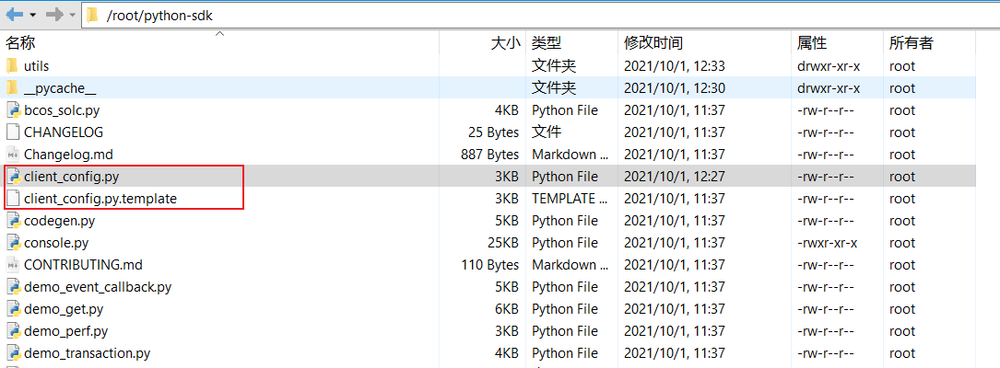

# 服务器环境配置

本文档大体参考[官方文档](https://fisco-bcos-documentation.readthedocs.io/zh_CN/latest/docs/sdk/python_sdk/install.html)，并做了简化，以及对官方文档的一些坑做了说明，正常来说跟随本文档的步骤，无需阅读官方文档就可以完成环境部署。

我在以下两种环境完成了环境配置：

* Ubuntu 20.04，系统自带了Python 3.8.x（不符合FISCO的环境要求）
* CentOS 7.6，系统自带了Python 2.7.5 和 Python 3.6.8（不符合FISCO的环境要求）


## 1. 安装依赖

根据官方文档

- **Ubuntu**: `sudo apt install -y zlib1g-dev libffi6 libffi-dev wget git`

- **CentOS**：`sudo yum install -y zlib-devel libffi-devel wget git`

注意：Ubuntu 20.04执行上述命令可能报错

```
Unable to locate package "libffi6"
```

改为使用以下命令可以解决

```
sudo apt install -y zlib1g-dev libffi7 libffi-dev wget git
```


## 2. 获取FISCO链 python-sdk源码

找一个合适的目录，执行:

```bash
git clone https://gitee.com/FISCO-BCOS/python-sdk
    
# 如果服务器访问GitHub速度快的话，也可以使用
git clone https://github.com/FISCO-BCOS/python-sdk
```


## 3. 安装支持的Python版本

支持版本：

* python 3.6.3
* python 3.7.x

如果服务器使用的Python版本符合要求，直接跳过这一步。

如果服务器的Python版本不符合要求，有两个方案。3.1为官方方案，可以尝试，但个人觉得不是太好用；3.2为我使用的方案，可用，但感觉有风险？

### 3.1 官方方案

```
# 判断python版本，并为不符合条件的python环境安装python 3.7.3的虚拟环境，命名为python-sdk
# 若python环境符合要求，可以跳过此步
# 若脚本执行出错，请检查是否参考[依赖软件]说明安装了依赖
# 提示：安装python-3.7.3可能耗时比较久
cd python-sdk && bash init_env.sh -p

# 激活python-sdk虚拟环境
source ~/.bashrc && pyenv activate python-sdk && pip install --upgrade pip
```

这个方案的问题在于，提供的脚本会尝试从GitHub下载东西，但我使用的服务器连不上GitHub（即使连上也很慢）。如果你的服务器没有这个问题，可以尝试这个方案。

### 3.2 我使用的方案

直接再安装一个符合要求的Python版本

* [Ubuntu参考](https://blog.csdn.net/Unsicherheit/article/details/106203250)
* [CentOS参考](https://tecadmin.net/install-python-3-7-on-centos/)

！！注意：两篇文章虽然大体一样，但Ubuntu那篇文章使用`sudo make && sudo make install`安装，这会导致原先的python版本会被替换（可能有风险？）；CentOS那篇文章使用`make altinstall`安装，会保留原有的python版本，即`python3 -V`显示原先的python版本，`python3.7 -V`显示新安装的python版本。


## 4. 安装Python SDK依赖

```
pip3.7 install -r requirements.txt

# 如果太慢，则使用国内镜像
pip3.7 install -i https://pypi.tuna.tsinghua.edu.cn/simple -r requirements.txt
```

> 注意执行pip命令时指定相应的版本（如果使用`pip`或`pip3`可能会安装依赖到原先的python2/python3.8等不符合要求的版本）


## 5. 初始化配置

官方文档在这一步使用`bash init_env.sh -i`做了以下两件事：

* 拷贝client_config.py.template -> client_config.py
* 下载solc编译器（脚本会尝试从GitHub下载东西，很慢，而且我们也不需要它的编译器）

所以，我们不使用官方提供的命令，只需手动复制`client_config.py.template`，并重命名为`client_config.py`即可，见下图




## 6. 配置client_config.py

官方文档的配置针对使用“Channel通信协议”，而我们使用更简单的rpc通信

编辑`client_config.py`，做两处修改：

* ```python
  # 修改前
  client_protocol = "channel"  # or PROTOCOL_CHANNEL to use channel prototol
  
  # 修改后
  client_protocol = "rpc"  # or PROTOCOL_CHANNEL to use channel prototol
  ```

* ```python
  # 修改前
  remote_rpcurl = "http://127.0.0.1:8545"  # 采用rpc通信时，节点的rpc端口,和要通信的节点*必须*一致,如采用channel协议通信，这里可以留空
  
  # 修改后
  remote_rpcurl = "http://49.235.72.8:8545"  # 采用rpc通信时，节点的rpc端口,和要通信的节点*必须*一致,如采用channel协议通信，这里可以留空
  ```


## 7. 测试

在python-sdk目录下，执行

```
python3.7 console.py getNodeVersion  #获取区块链节点版本信息
python3.7 console.py getBlockNumber  #获取最新块高

# 以下是官方提供的命令，没有指定python版本，可能没法运行
./console.py getNodeVersion
```

如果可以正常显示信息，则环境配置完成

